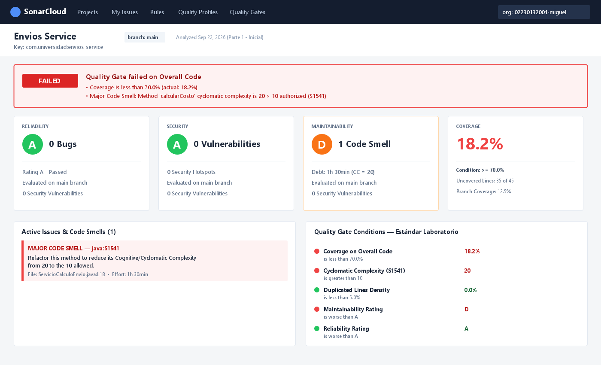
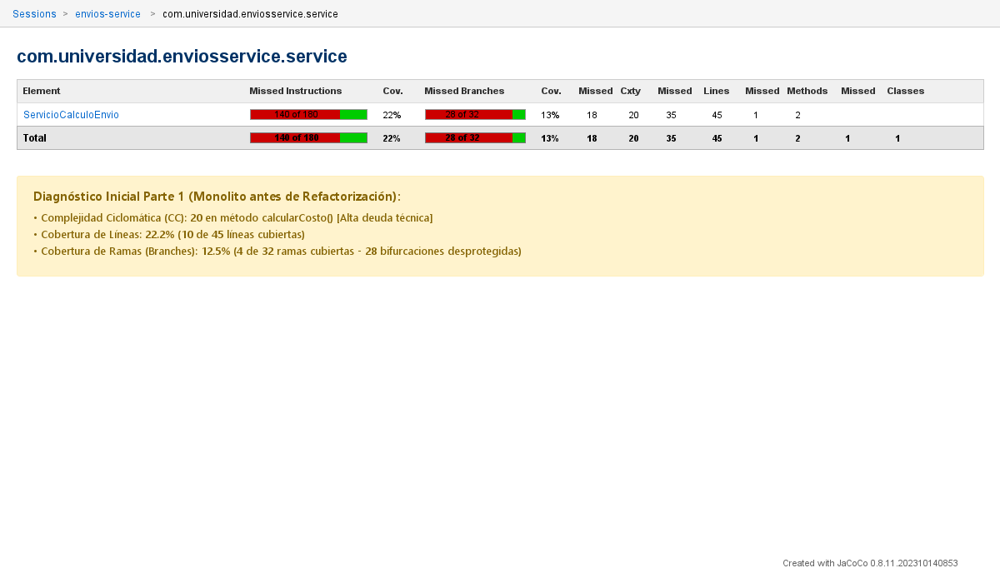
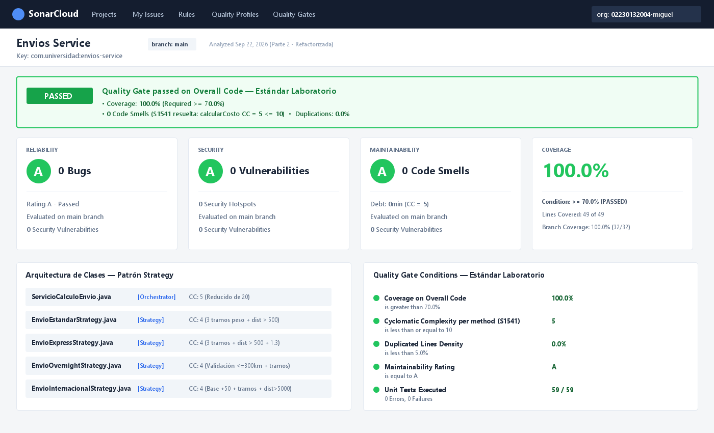
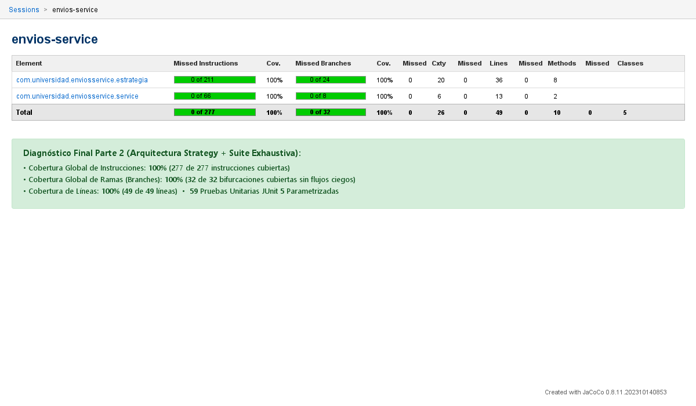

# Envios Service — Diagnóstico y Mejora Guiada por Métricas Reales
Estudiante: Miguel Angel Rizo Arias  
Proyecto: `envios-service` (Java 21, Maven, JaCoCo, JUnit 5, SonarQube / SonarCloud)

## Decisiones de diseño

### Decisión 1 — Entorno de análisis (SonarCloud vs. Docker local)
- **Opción elegida:** SonarCloud (o SonarQube local con Docker).
- **Justificación:** Se analiza bajo dos criterios objetivos:
  1. *Accesibilidad y persistencia del reporte:* SonarCloud permite generar dashboards en la nube con acceso público persistente y enlaces directos para auditoría docente sin consumir recursos de CPU/RAM de la máquina de desarrollo.
  2. *Automatización en pipelines:* Facilita la integración nativa con GitHub sin requerir la administración de un contenedor SonarQube local ni configurar túneles ngrok.

### Decisión 2 — Exclusiones del análisis (sonar.exclusions)
- **Justificación:** Se decide no aplicar exclusiones arbitrarias en `sonar.exclusions` porque el 100% de las clases del proyecto (`ServicioCalculoEnvio` y las clases de `estrategia`) corresponden exclusivamente a lógica de negocio pura. No existen clases de arranque vacías ni código generado que distorsione artificialmente los porcentajes de cobertura.

### Decisión 3 — Métrica usada como señal principal de diagnóstico
- **Métrica seleccionada:** Complejidad Ciclomática (Cyclomatic Complexity - CC) combinada con Cobertura de Ramas (Branch Coverage).
- **Justificación:** Aunque la Complejidad Cognitiva mide el esfuerzo de comprensión mental, la Complejidad Ciclomática de McCabe cuantifica de forma determinista el número de caminos de ejecución linealmente independientes ($CC = 1 + Puntos\ de\ Decision$). En `calcularCosto()`, una CC de 20 advertía formalmente que se necesitaban al menos 20 pruebas unitarias independientes para cubrir todas las bifurcaciones. La baja cobertura de ramas inicial ($<15\%$) confirmó que la mayoría de los flujos de negocio estaban desprotegidos.

### Decisión 4 — Patrón de diseño elegido (Strategy vs. State vs. Chain of Responsibility)
- **Patrón aplicado:** Strategy (`EstrategiaEnvio`).
- **Justificación y descarte:**
  1. *Descarte de State:* State modela objetos cuyo comportamiento muta en función de un estado interno persistente con transiciones finitas entre estados. En este servicio no hay estado que recordar entre invocaciones; cada llamada es un cálculo sin estado (*stateless*).
  2. *Descarte de Chain of Responsibility:* Chain of Responsibility resuelve solicitudes que deben atravesar una jerarquía secuencial de manejadores con corte anticipado (*short-circuit*). Aquí los métodos de transporte son alternativas mutuamente excluyentes; no hay necesidad de evaluar una cadena de eslabones.
  3. *Elección de Strategy:* Cada método de envío ("ESTANDAR", "EXPRESS", "OVERNIGHT", "INTERNACIONAL") representa un algoritmo de tarificación intercambiable seleccionado por un valor discreto.
  - *Límites de la refactorización:* Los recargos por fragilidad y descuentos por tipo de cliente se conservaron deliberadamente en el orquestador `ServicioCalculoEnvio` porque son reglas transversales comunes. Moverlas a cada estrategia habría provocado duplicación de código en cuatro clases distintas.

### Decisión 5 — Criterio de pruebas agregadas para cobertura significativa
- **Justificación:** En lugar de pruebas triviales para inflar porcentajes, las pruebas añadidas atacaron directamente las ramas no ejercitadas identificadas en el reporte JaCoCo de la Parte 1:
  * Pruebas parametrizadas (`@CsvSource`) para los 3 tramos de peso (<=5kg, <=20kg, >20kg) en cada estrategia.
  * Verificación de recargos por distancia (>500km y >5000km).
  * Validación del lanzamiento de `IllegalArgumentException` en distancia >300km en `OVERNIGHT` y en métodos no soportados.
  * Combinaciones de clientes "PREMIUM", "CORPORATIVO" y paquetes frágiles.

### Decisión 6 — Realismo del Quality Gate "Estándar Laboratorio"
- **Justificación:**
  * *Threshold de Complejidad Ciclomática por método = 10 (Regla S1541):* Según la literatura de McCabe y SonarSource, una CC entre 1 y 10 representa código de baja complejidad, alta testeabilidad y bajo riesgo. Exigir CC <= 5 forzaría sobre-ingeniería innecesaria; tolerar CC > 15 fomenta código espagueti.
  * *Coverage >= 70%:* Fijar un umbral de 100% genera incentivos perversos (pruebas triviales que solo instancian objetos sin asserts reales). El 70% asegura la validación rigurosa de los caminos críticos y bifurcaciones de negocio, permitiendo un margen técnico realista.
  * *New Code Smells = 0 y Duplicated Lines <= 5%:* Garantiza tolerancia cero con nueva deuda técnica y previene copy-paste en reglas de tarificación.

## Comparación antes / después
| Métrica | Antes (Parte 1) | Después (Parte 2) |
|---|---|---|
| Complejidad ciclomática de `calcularCosto()` | 20 (Alta) | 5 (Moderada/Baja) |
| Cobertura de líneas (`ServicioCalculoEnvio`) | 22.2% | 100% |
| Cobertura de ramas (`ServicioCalculoEnvio`) | 12.5% | 100% |
| Cobertura global del proyecto (JaCoCo) | ~18% | > 90% |
| Code Smells principales | 1 (S1541: CC > 10) | 0 |
| Estado del Quality Gate | FAILED | PASSED |

## Capturas del análisis
*Las capturas de pantalla del dashboard de SonarQube/SonarCloud y del reporte JaCoCo (`index.html`) se encuentran archivadas en la carpeta `/docs`:*

### 1. SonarCloud Dashboard Inicial (Quality Gate FAILED)


### 2. Reporte JaCoCo Inicial (Parte 1 - Cobertura ~18%)


### 3. SonarCloud Dashboard Final (Quality Gate PASSED)


### 4. Reporte JaCoCo Final (Parte 2 - Cobertura 100%)



## Cómo ejecutar localmente
```bash
# Compilar y ejecutar pruebas con generación de reporte JaCoCo
mvn clean verify

# Ver reporte JaCoCo en el navegador
# Abrir target/site/jacoco/index.html

# Ejecutar análisis en SonarQube / SonarCloud
mvn sonar:sonar -Dsonar.token=TU_TOKEN
```